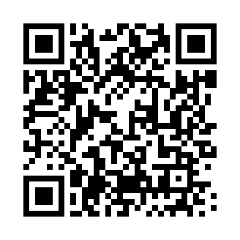

# cybersecurity-portfolio

## About Me

I am a cybersecurity professional building hands-on experience across networking, system security, cryptography, security operations, and secure software development. My primary interests are technology and cyber risk, particularly bridging the gap between technical cybersecurity and business needs to help organizations understand risk, strengthen security, and make informed business decisions.

## Goals

- Continue developing hands-on cybersecurity engineering and security operations skills
- Build experience in cyber risk, security consulting, and cloud security
- Develop a strong understanding of security frameworks, risk assessment, governance, and compliance
- Earn industry-recognized cybersecurity certifications
- Build portfolio projects that demonstrate both technical ability and the ability to communicate security risks and solutions to organizations and executives

## Skills at a Glance

| Category | Tools / Concepts |
|---|---|
| Networking & Security Fundamentals | TCP/IP, DNS, DHCP, ARP, firewalls, network attacks and defenses |
| Linux & Windows Administration | Linux, Kali Linux, Ubuntu, Windows, SSH, Apache |
| Security Tools | Wireshark, Nmap, OpenSSL, Ettercap |
| Cryptography & PKI | AES, public/private key cryptography, TLS, certificates, PKI |
| Offensive Security Labs | Password cracking labs, ARP poisoning concepts, DHCP attacks, DoS concepts |
| Secure Development | Python, Git, GitHub, local LLM integration |
| AI & Privacy Engineering | Ollama, local AI models, memory systems, privacy-first architecture |

## What's In This Repository

| Folder | What You'll Find |
|---|---|
| [soc-tools](./soc-tools) | Security operations tools, detection concepts, and SOC-related work |
| [malware-analysis](./malware-analysis) | Malware analysis notes and future lab work |
| [grc](./grc) | Governance, risk, compliance, frameworks, and security controls |
| [research-and-writeups](./research-and-writeups) | Security research, technical explanations, and incident writeups |
| [presentations](./presentations) | Cybersecurity presentations and supporting material |
| [templates](./templates) | Security documentation templates, checklists, and reusable resources |
| [certifications-and-skills](./certifications-and-skills) | Certification progress and hands-on skills tracker |
| [tls-audits](./tls-audits) | TLS and certificate security audit reports |

## Contact

### Portfolio QR Code

Scan to open the live portfolio:

